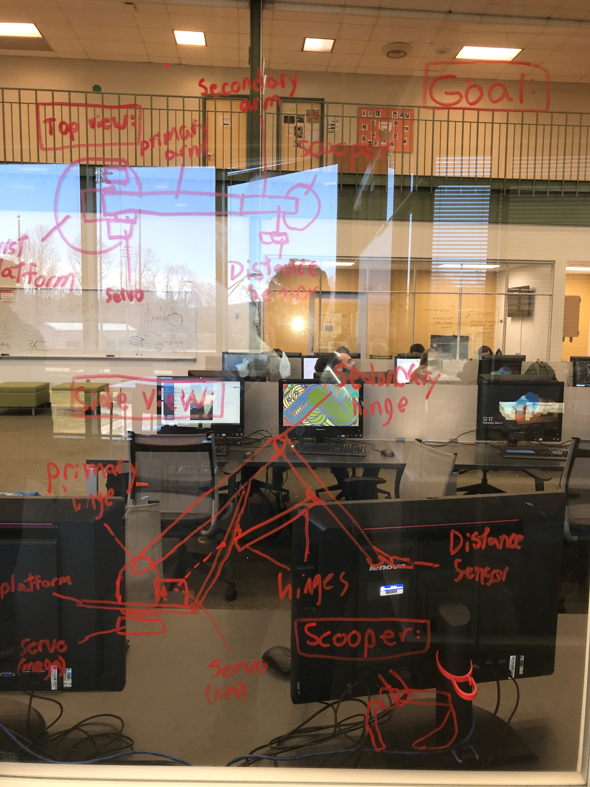

# BeanMover

## Page Layout

-

# Goal

The Purpose of this project is to create an arm that is c

# Planning 

We are going to create a robotic arm that detects something in a specific location and relocates the object to another location. 

# Schedule

- **Week 1**
Finish Planning and flesh out full design

- **Week 2**
Progress on Solidworks design and start on code

- **Week 3**
Print/cut first draft, fix errors

- **Week 4**
Repair flaws and adjust design and continue fleshing out code.

- **Week 5**
Reprint secondary prototype or finished product

- **Week 6**
Code experimentation

- **Week 7**
Complete code

- **Week 8**
Review design and coding and evaluate success. 
